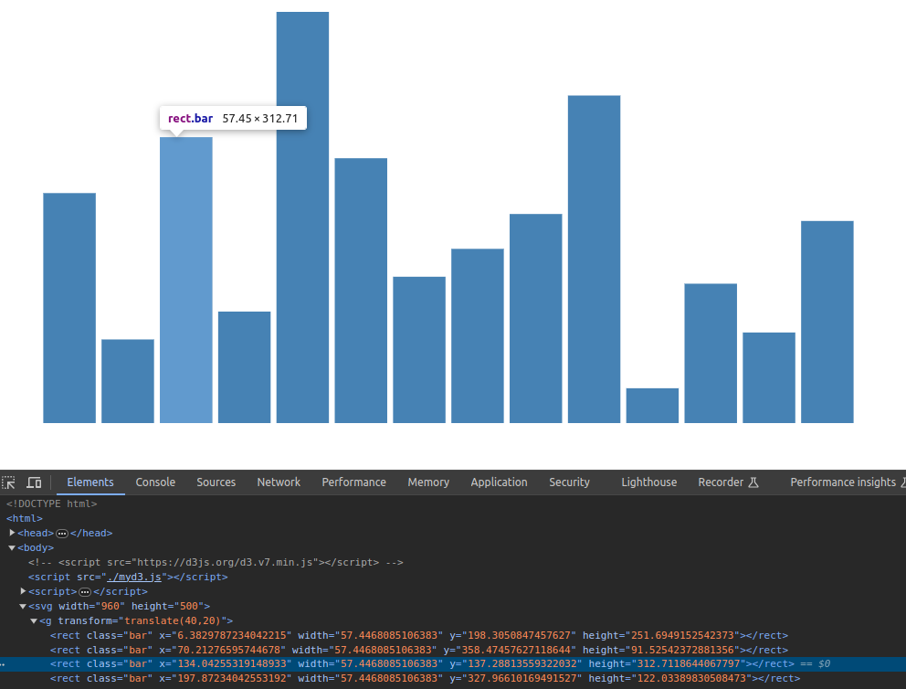
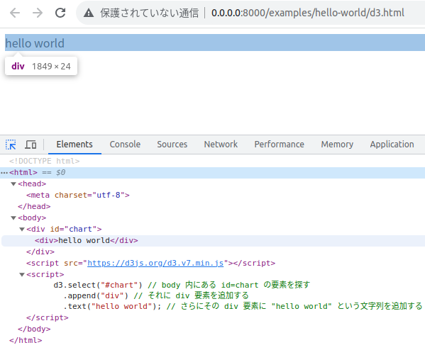
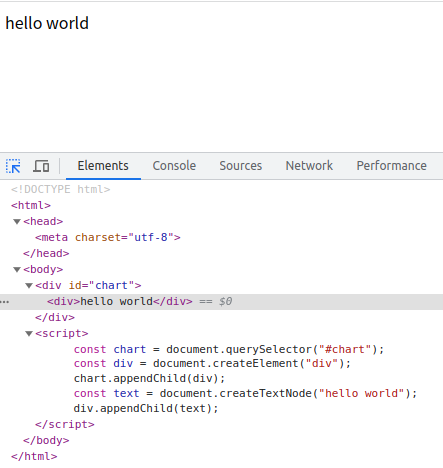
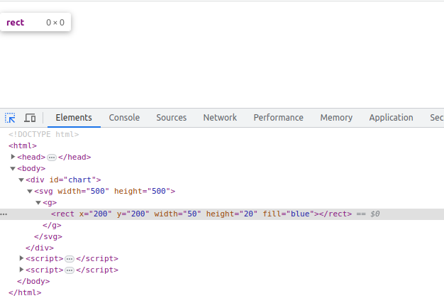
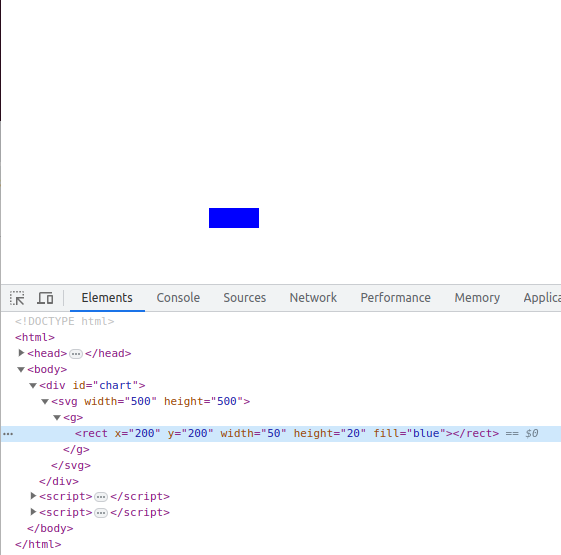
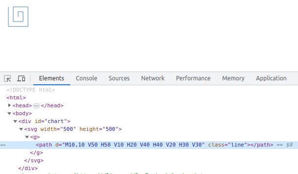
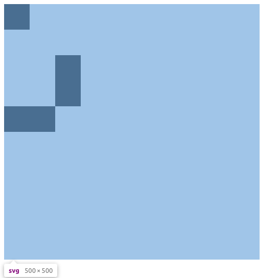
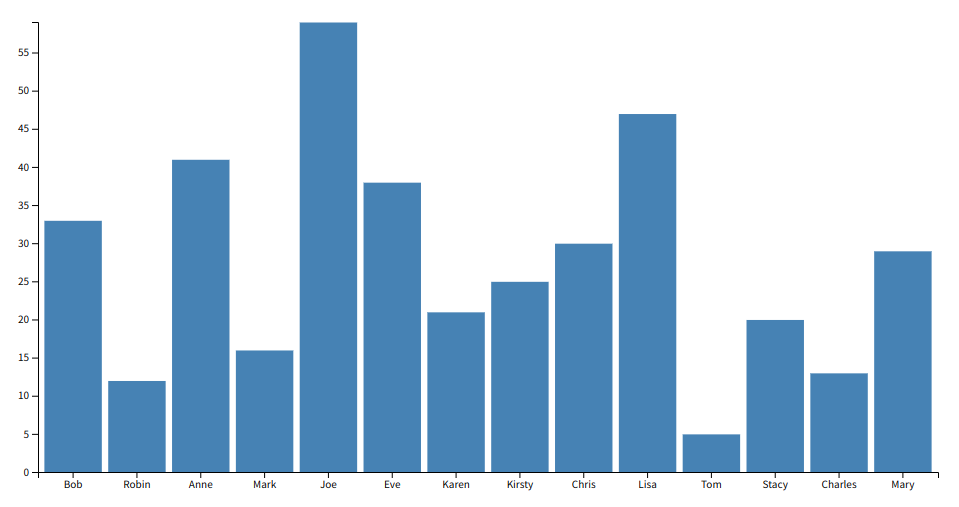
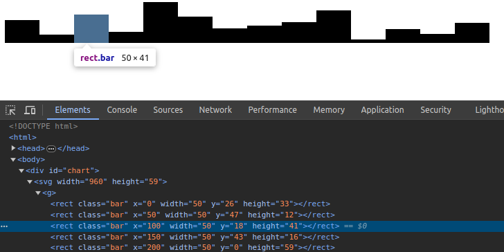
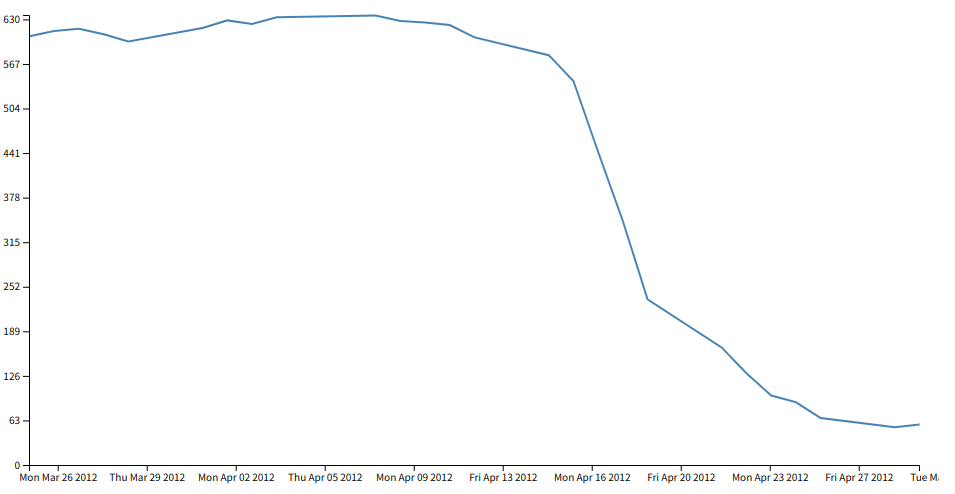

# Build Your Own D3.js in 300 Lines of Code: Understanding D3 Internals by Reimplementing from Scratch



To use [D3] effectively while understanding its internal workings, it's important to grasp features like the selection API, scale, and axis in advance.
To help with this, I created a script called [mini-d3.js] and its [bar chart demo] that demonstrate these features using a D3-like API.

[D3]: https://github.com/d3/d3
[mini-d3.js]: https://github.com/oshikiri/build-your-own-d3/blob/main/mini-d3.js
[bar chart demo]: https://oshikiri.github.io/build-your-own-d3/demo/bar_chart.html


## Introduction

The goal of this document is to demonstrate how a small, D3-like library can run a D3 bar chart demo by replacing `<script src="https://d3js.org/d3.v7.min.js"></script>` with `<script src="./mini-d3.js"></script>`.
Note that mini-d3.js is a simplified, educational library, not a compatible D3 substitute.
It intentionally omits most of D3's features and only supports the examples in this document.

### Scope of This Document
This section clarifies the document's purpose and the boundaries of its coverage.
It concentrates on core D3 APIs and the process of crafting a minimal D3-like library[^scope].
Here is what this document will and will not cover:

**This document covers:**
- The behavior and implementation of D3's basic APIs
- How to create a library that behaves like D3

**This document does not cover:**
- How to use D3
    - If you're unsure about D3 basics, I recommend reading [D3 Tips and Tricks v7.x by Malcolm Maclean][d3-tips] before this document.
- D3's data handling (such as d3-array)
- Advanced visualizations like d3-geo
- Knowledge of JavaScript (especially DOM manipulation), CSS, or SVG

Writing this, I wonder who the intended audience really is.
I wrote this section after nearly finishing the document, but I still don't know.


[d3-tips]: https://leanpub.com/d3-t-and-t-v7

[^scope]: After starting to write this document, I realized that covering everything about D3 would be impossible to finish, so I decided to narrow down the topics.


### Environment


This document is based on D3 ([v7.8.5][d3-v7.8.5]), the latest version at the time of writing.
Since this document only covers basic features, differences in recent versions should have little effect.
The last major change to the basic API was in the [2018 update][d3-2018-update], and D3 has been stable since then [^d3-selection-last-update].

All code in this document was tested in Chrome v120.

[^d3-selection-last-update]: As of September 30, 2023, d3-selection (which appears later) was [last updated two years ago][d3-selection-last-update-link].

[d3-v7.8.5]: https://github.com/d3/d3/blob/v7.8.5
[d3-2018-update]: https://github.com/d3/d3/blob/main/CHANGES.md#changes-in-d3-50
[d3-selection-last-update-link]: https://github.com/d3/d3-selection/commit/91245ee124ec4dd491e498ecbdc9679d75332b49


## Drawing Simple Shapes
Before implementing the chart drawing process, let's make sure we can draw simple shapes (text, rectangles, lines, etc.).
These shapes are used as building blocks for basic charts like bar charts and line charts.

### Drawing Text
First, let's implement a process that simply draws the string `hello world` on the screen.

If you implement this in D3, the code looks like the following.
From now on, we refer to the officially distributed d3.v7.min.js as "official D3".

I'll add line-by-line comments for explanation.

**demo/insert-text/d3.html (official D3):**
```html
<!doctype html>
<meta charset="utf-8" />
<body>
  <div id="chart"></div>

  <script src="https://d3js.org/d3.v7.min.js"></script>

  <script>
    d3.select("#chart")     // Find the element with id=chart in the body
      .append("div")        // Add a div element to it
      .text("hello world"); // Add the string "hello world" to the div element
  </script>
</body>
```

When the last `<script>` is executed, the div element with the ID `#chart` is updated, and `<div>hello world</div>` is added inside `chart` as shown in the following figure.



Let's try reimplementing the `d3` used in this sample.

First, if you read the contents written in the comments, you'll notice that it can be implemented directly in JavaScript.
Let's try writing it.

**demo/insert-text/vanilla-js.html (Web API version):**
```html
<!doctype html>
<meta charset="utf-8" />
<body>
  <div id="chart"></div>

  <script>
    const chart = document.querySelector("#chart");
    const div = document.createElement("div");
    chart.appendChild(div);
    const text = document.createTextNode("hello world");
    div.appendChild(text);
  </script>
</body>
```


If you save the above code as an HTML file and open it in your browser, you will see that it behaves the same way as the official D3 version.



The goal of this document is to implement a library that behaves like D3, using the same interface.
So, let's match the interface next.

Looking again at the official D3 version's chart drawing code, you can see that `d3.select("#chart").append("div").text("hello world");` uses D3's characteristic method-chaining interface.
Also, according to [@types/d3-selection][types-d3-selection], the return value of `d3.select` is a `Selection`.
Based on this information, let's add a `Selection` class as shown below[^original-d3-select].

[types-d3-selection]: https://github.com/DefinitelyTyped/DefinitelyTyped/blob/61748a217350dddbef9842803adf8533a8b1e8b9/types/d3-selection/index.d.ts#L107-L121

**demo/insert-text/myd3.html (mini-d3 version):**
```html
<!doctype html>
<meta charset="utf-8" />
<body>
  <div id="chart"></div>

  <script>
    const d3 = {
      select(selector) {
        const el = document.querySelector(selector);
        return new Selection(el);
      },
    };

    class Selection {
      element;
      constructor(element) {
        this.element = element;
      }
      append(name) {
        const child = document.createElement(name);
        this.element.append(child);
        return new Selection(child);
      }
      text(content) {
        const txt = document.createTextNode(content);
        this.element.append(txt);
        return this;
      }
    }
  </script>

  <script>
    d3.select("#chart").append("div").text("hello world");
  </script>
</body>
```

- [code](https://github.com/oshikiri/build-your-own-d3/blob/main/demo/insert-text/myd3.html)
- [demo](https://www.oshikiri.org/build-your-own-d3/demo/insert-text/myd3.html)


If you save this as HTML and open it in your browser, you will see it behaves the same as the official D3 version.

From here, we will gradually extend this implementation to support more shapes and charts.


[^original-d3-select]: The [actual implementation of `d3.select`](https://github.com/d3/d3-selection/blob/v3.0.0/src/select.js) also just returns a [`Selection`](https://github.com/d3/d3-selection/blob/v3.0.0/src/selection/index.js), just like our mini-d3 version.

### Drawing Rectangles

Here is the code to draw a rectangle using official D3.

**demo/rectangle/d3.html:**
```html
<!doctype html>
<meta charset="utf-8" />
<body>
  <div id="chart"></div>

  <script src="https://d3js.org/d3.v7.min.js"></script>

  <script>
    const svg = d3
      .select("#chart")
      .append("svg")
      .attr("width", 500)
      .attr("height", 500)
      .append("g");
    svg
      .append("rect")
      .attr("x", 200)
      .attr("y", 200)
      .attr("width", 50)
      .attr("height", 20)
      .attr("fill", "blue");
  </script>
</body>

```

When you run this, it adds the SVG element to `#chart` as follows:

```html
<div id="chart">
  <svg width="500" height="500">
    <g>
      <rect x="200" y="200" width="50" height="20" fill="blue"></rect>
    </g>
  </svg>
</div>
```

Here's what this code does:
1. Creates a 500x500 `svg` element.
2. Appends a `g` element inside it.
3. Draws a 50x20 blue `rect` at position (200, 200) within the `g` element.

Here, we use a new method called `attr`, so we need to implement it as well.
Let's add an `attr` method to the `Selection` class as follows:

```js
attr(key, value) {
  this.element.setAttribute(key, value);
  return this;
}
```


However, even after adding the `attr` method, the rectangle still does not appear.



This is a common pitfall when working with SVG. For now, let's set aside the reason and simply change the code from the "Before" to the "After" version to resolve the error.

```js
// Before
const child = document.createElement(name);
```

```js
// After
const child = document.createElementNS(
  "http://www.w3.org/2000/svg",
  name,
);
```

After making this change, the rectangle appears as expected, as shown in the following image:



Why do we need to use `createElementNS` instead of `createElement`?
What we want to create here is an `<svg>` element in the SVG namespace, but `document.createElement("svg")` creates an `svg` element in the HTML namespace[^createelement].
Therefore, to create an `<svg>` element in the SVG namespace, you need to explicitly specify the namespace as the first argument to `createElementNS`.

- [svg - SVG: Scalable Vector Graphics | MDN](https://developer.mozilla.org/en-US/docs/Web/SVG/Reference/Element/svg)
- [Namespaces crash course - SVG: Scalable Vector Graphics | MDN](https://developer.mozilla.org/en-US/docs/Web/SVG/Guides/Namespaces_crash_course)
- [No `createElement` with SVG | webhint documentation](https://webhint.io/docs/user-guide/hints/hint-create-element-svg/)

In the [actual implementation of append][d3-selection-append], D3 uses `http://www.w3.org/2000/svg` as the namespace for `append("svg")`, and for other cases, it inherits the parent's namespace.
By the way, D3 also [supports namespaces other than SVG][d3-selection-namespaces].

[^createelement]: I realized that [the MDN documentation][mdn-createElement] for `Document.createElement` clearly states: "In an HTML document, the `document.createElement()` method creates the HTML element specified by `localName` ..."

[d3-selection-append]: https://d3js.org/d3-selection/modifying#selection_append
[d3-selection-namespaces]: https://d3js.org/d3-selection/namespaces
[mdn-createElement]: https://developer.mozilla.org/en-US/docs/Web/API/Document/createElement

For reference, here is the complete source code.

**demo/rectangle/myd3.html:**
```html
<!doctype html>
<meta charset="utf-8" />
<body>
  <div id="chart"></div>

  <script>
    const d3 = {
      select(selector) {
        const el = document.querySelector(selector);
        return new Selection(el);
      },
    };

    class Selection {
      element;
      constructor(element) {
        this.element = element;
      }
      append(name) {
        const child = document.createElementNS(
          "http://www.w3.org/2000/svg",
          name,
        );
        this.element.append(child);
        return new Selection(child);
      }
      text(content) {
        const txt = document.createTextNode(content);
        this.element.append(txt);
        return this;
      }
      attr(key, value) {
        this.element.setAttribute(key, value);
        return this;
      }
    }
  </script>

  <script>
    const svg = d3
      .select("#chart")
      .append("svg")
      .attr("width", 500)
      .attr("height", 500)
      .append("g");
    svg
      .append("rect")
      .attr("x", 200)
      .attr("y", 200)
      .attr("width", 50)
      .attr("height", 20)
      .attr("fill", "blue");
  </script>
</body>
```

- [code](https://github.com/oshikiri/build-your-own-d3/blob/main/demo/rectangle/myd3.html)
- [demo](https://www.oshikiri.org/build-your-own-d3/demo/rectangle/myd3.html)


### Drawing a Path



**examples/svg-path/d3.html:**
```html
<!doctype html>
<meta charset="utf-8" />
<style>
  .line {
    fill: none;
    stroke: steelblue;
    stroke-width: 1px;
  }
</style>
<body>
  <div id="chart"></div>

  <script src="https://d3js.org/d3.v7.min.js"></script>

  <script>
    const pathDefinition = "M10,10 V50 H50 V10 H20 V40 H40 V20 H30 V30";
    const svg = d3
      .select("#chart")
      .append("svg")
      .attr("width", 500)
      .attr("height", 500)
      .append("g");
    svg.append("path").attr("d", pathDefinition).attr("class", "line");
  </script>
</body>
```

In fact, the current implementation can add a path.
For more information about SVG `<path>`, here are some useful links:

- [`<path>` - SVG: Scalable Vector Graphics | MDN](https://developer.mozilla.org/en-US/docs/Web/SVG/Element/path)
- [Paths - SVG: Scalable Vector Graphics | MDN](https://developer.mozilla.org/en-US/docs/Web/SVG/Tutorial/Paths)


### Loading Data from External JSON

**examples/load-json/data.json:**
```json
[
  { "x": 0, "y": 0, "width": 50, "height": 50 },
  { "x": 100, "y": 100, "width": 50, "height": 100 },
  { "x": 0, "y": 200, "width": 100, "height": 50 }
]
```

Using `d3.json`, load the above JSON file and draw multiple rectangles as shown in the figure below.



Here is the official D3 version code:

**examples/load-json/d3.html:**
```html
<!doctype html>
<meta charset="utf-8" />
<body>
  <div id="chart"></div>

  <script src="https://d3js.org/d3.v7.min.js"></script>
  <script>
    const svg = d3
      .select("#chart")
      .append("svg")
      .attr("width", 500)
      .attr("height", 500)
      .append("g");

    d3.json("./data.json").then((data) => {
      for (const d of data) {
        svg
          .append("rect")
          .attr("class", "bar")
          .attr("x", d.x)
          .attr("y", d.y)
          .attr("width", d.width)
          .attr("height", d.height);
      }
    });
  </script>
</body>
```

If you are familiar with D3 examples, you might find the absence of `data` and `enter` in the above code strange[^d3-without-selection].
The reason for this coding style is that `data` and `enter` are somewhat complicated and couldn't be implemented right away.

[^d3-without-selection]: However, until you get used to the d3-selection API, it might not be a bad idea to continue using this kind of coding style (even though it's not the standard way). But once you're familiar with it, using the d3-selection API is more convenient.

The `d3.json` function simply returns a `Promise`, so the following implementation is sufficient.

**d3 definition in examples/load-json/myd3.html:**
```js
const d3 = {
  select(selector) {
    const el = document.querySelector(selector);
    return new Selection(el);
  },
  async json(path) {
    const response = await fetch(path);
    return response.json();
  },
};
```

Interestingly, the actual [d3-fetch source code][d3-fetch-json] is almost the same as this implementation.

[d3-fetch-json]: https://github.com/d3/d3-fetch/blob/v3.0.1/src/json.js


### Organizing as a Package
As the codebase grows, it would be ideal to organize it as a package.
However, for the sake of step-by-step explanation, this document keeps all implementations in a single JS file.

**examples/setup-package/myd3.html:**
```js
<!doctype html>
<meta charset="utf-8" />
<body>
  <div id="chart"></div>

  <script src="./myd3.js"></script>
  <script>
    const svg = d3
      .select("#chart")
      .append("svg")
      .attr("width", 500)
      .attr("height", 500)
      .append("g");

    d3.json("./data.json").then((data) => {
      for (const d of data) {
        svg
          .append("rect")
          .attr("class", "bar")
          .attr("x", d.x)
          .attr("y", d.y)
          .attr("width", d.width)
          .attr("height", d.height);
      }
    });
  </script>
</body>
```

**examples/setup-package/myd3.js:**
```js
const d3 = {
  select(selector) {
    const el = document.querySelector(selector);
    return new Selection(el);
  },
  async json(path) {
    const response = await fetch(path);
    return response.json();
  },
};

class Selection {
  element;
  constructor(element) {
    this.element = element;
  }
  append(name) {
    const child = document.createElementNS(
      "http://www.w3.org/2000/svg",
      name,
    );
    this.element.append(child);
    return new Selection(child);
  }
  text(content) {
    const txt = document.createTextNode(content);
    this.element.append(txt);
    return this;
  }
  attr(key, value) {
    this.element.setAttribute(key, value);
    return this;
  }
}
```

If you want to organize it as a package, the actual structure of D3 can be a reference.
Looking at [the actual structure of D3][d3-structure], it seems that the repositories are divided roughly by functionality, and the d3/d3 repository is used to load all d3-* packages[^d3-adopt-a-monorepo]。

[d3-structure]: https://github.com/d3/d3/blob/v7.8.5/src/index.js

[^d3-adopt-a-monorepo]: However, this may change in the future:
  [Adopt a monorepo · Issue #3791 · d3/d3](https://github.com/d3/d3/issues/3791)


## Drawing Bar Charts

In this section, the goal is to be able to draw bar charts like the one below ([Demo page][bar-chart-demo]).



The chart is the one used in "D3 Tips and Tricks v7.x", and the original data is already uploaded to [this JSON][sales-json].

[bar-chart-demo]: https://oshikiri.github.io/build-your-own-d3/demo/bar_chart.html
[sales-json]: https://github.com/oshikiri/build-your-own-d3/blob/main/demo/data/sales.json

From here, the implementation becomes quite complicated, so we will proceed by extracting only the necessary parts from the official D3 implementation.
In particular, in this section, we will refer to the implementation of [d3-selection].

[d3-selection]: https://github.com/d3/d3-selection

### Drawing the Bars of the Bar Chart

Ignoring the scaling process and ticks for now, let's first draw just the bars of the bar chart as shown in the figure below.



First, let's create the code to draw this using the official D3.

**examples/bar-chart/bars/myd3.html:**
```html
<!doctype html>
<meta charset="utf-8" />
<body>
  <div id="chart"></div>

  <!-- <script src="./myd3.js"></script> -->
  <script src="https://d3js.org/d3.v7.min.js"></script>

  <script>
    // Since scaling is not implemented, for now, hardcode the maximum value of sales
    const height = 59;
    const width = 960;
    const barwidth = 50;

    const svg = d3
      .select("#chart")
      .append("svg")
      .attr("width", width)
      .attr("height", height)
      .append("g");

    d3.json("./../sales.json").then((data) => {
      svg
        .selectAll(".bar")
        .data(data)
        .enter()
        .append("rect")
        .attr("class", "bar")
        .attr("x", function (d) {
          return xScale(d.salesperson);
        })
        .attr("width", barwidth)
        .attr("y", function (d) {
          return yScale(d.sales);
        })
        .attr("height", function (d) {
          return height - yScale(d.sales);
        });

      svg
        .append("g")
        .attr("transform", `translate(0,${height})`)
        .call(d3.axisBottom(xScale));

      svg.append("g").call(d3.axisLeft(yScale));
    });

    // Temporary implementation
    let called = -1;
    function xScale(name) {
      called += 1;
      return barwidth * called;
    }
    function yScale(y) {
      return 59 - y;
    }
  </script>
</body>
```

To make this sample code work with my D3, I need to implement `d3.selectAll`, `Selection.data`, and `Selection.enter`, and also make `Selection.attr` able to use the bound data.
Based on the implementation of d3-selection, let's add the following implementations.

**examples/bar-chart/bars/myd3.js:**
```js
const d3 = {
  select(selector) {
    const element = document.querySelector(selector);
    return new Selection([[element]], [document.documentElement]);
  },
  async json(path) {
    const response = await fetch(path);
    return response.json();
  },
  scaleBand,
  scaleLinear,
  axisLeft,
  axisBottom,
};

class Selection {
  #groups;
  #parents;
  #enter;

  constructor(groups, parents) {
    this.#groups = groups;
    this.#parents = parents;
  }

  append(name) {
    return this.select(function () {
      const child = document.createElementNS(
        "http://www.w3.org/2000/svg",
        name,
      );
      child.__data__ = this.__data__;
      return this.appendChild(child);
    });
  }

  select(selectorOrFunction) {
    const selectFunction = this.#makeSelectFunction(selectorOrFunction);
    const subgroups = this.#groups.map((group) =>
      group.map((node, i) => {
        if (node === null) {
          return undefined;
        }
        const subnode = selectFunction.call(node, node.__data__, i, group);
        if ("__data__" in node) {
          subnode.__data__ = node.__data__;
        }
        return subnode;
      }),
    );

    return new Selection(subgroups, this.#parents);
  }

  #makeSelectFunction(selectorOrFunction) {
    if (typeof selectorOrFunction === "string") {
      return function () {
        return this.querySelector(selectorOrFunction);
      };
    } else {
      return selectorOrFunction;
    }
  }

  attr(key, valueOrFunction) {
    return this.#each(function (__data__) {
      const value = Selection.getValue(valueOrFunction, __data__);
      this.setAttribute(key, value);
      return this;
    });
  }

  static getValue(valueOrFunction, __data__) {
    if (typeof valueOrFunction === "function") {
      return valueOrFunction(__data__);
    } else if (["number", "string"].includes(typeof valueOrFunction)) {
      return String(valueOrFunction);
    } else {
      return valueOrFunction.apply(__data__);
    }
  }

  #each(callback) {
    const groups = this.#groups.map(function (group) {
      return group.map(function (node, i) {
        return callback.call(node, node.__data__, i);
      });
    });
    return new Selection(groups, this.#parents);
  }

  selectAll(selector) {
    const subgroups = [];
    const parents = [];
    this.#groups.forEach((group) => {
      group.forEach((node) => {
        subgroups.push(Array.from(node.querySelectorAll(selector)));
        parents.push(node);
      });
    });
    return new Selection(subgroups, parents);
  }

  data(__data__) {
    const groupsLength = this.#groups.length;
    const dataLength = __data__.length;
    const enter = new Array(groupsLength);
    for (let i = 0; i < groupsLength; i++) {
      enter[i] = new Array(dataLength);
      Selection.bindIndex(
        this.#parents[i],
        this.#groups[i],
        enter[i],
        __data__,
      );
    }
    this.#enter = enter;
    return this;
  }

  static bindIndex(parent, group, enter, data) {
    for (let i = 0; i < data.length; i++) {
      if (i < group.length) {
        group[i].__data__ = data[i];
      } else {
        enter[i] = new EnterNode(parent, data[i]);
      }
    }
  }

  enter() {
    return new Selection(this.#enter || this.#groups, this.#parents);
  }

  call(callback) {
    arguments[0] = this;
    callback.apply(null, arguments);
    return this;
  }
}

class EnterNode {
  constructor(parent, __data__) {
    this.parent = parent;
    this.__data__ = __data__;
  }
  appendChild(child) {
    return this.parent.appendChild(child);
  }
}

function scaleBand() {}

function scaleLinear() {}

function axisLeft() {
  return function () {};
}

function axisBottom() {
  return function () {};
}
```


### Implementing the Scaling Process

Here, we implement the scaling processes such as `d3.scaleBand` that were omitted in the previous code.
The code to draw the bar chart is as follows:

```html
<!doctype html>
<meta charset="utf-8" />
<style>
  .bar {
    fill: steelblue;
  }
</style>
<body>
  <!-- <script src="https://d3js.org/d3.v7.min.js"></script> -->
  <script src="./myd3.js"></script>

  <script>
    const svgWidth = 960;
    const svgHeight = 500;
    const margin = { top: 20, right: 20, bottom: 30, left: 40 };
    const width = svgWidth - margin.left - margin.right;
    const height = svgHeight - margin.top - margin.bottom;

    const xScale = d3.scaleBand().range([0, width]).padding(0.1);
    const yScale = d3.scaleLinear().range([height, 0]);

    const svg = d3
      .select("body")
      .append("svg")
      .attr("width", svgWidth)
      .attr("height", svgHeight)
      .append("g")
      .attr("transform", "translate(" + margin.left + "," + margin.top + ")");

    d3.json("../sales.json").then(function (data) {
      xScale.domain(
        data.map(function (d) {
          return d.salesperson;
        }),
      );
      yScale.domain([
        0,
        Math.max(
          ...data.map(function (d) {
            return d.sales;
          }),
        ),
      ]);

      svg
        .selectAll(".bar")
        .data(data)
        .enter()
        .append("rect")
        .attr("class", "bar")
        .attr("x", function (d) {
          return xScale(d.salesperson);
        })
        .attr("width", xScale.bandwidth())
        .attr("y", function (d) {
          return yScale(d.sales);
        })
        .attr("height", function (d) {
          return height - yScale(d.sales);
        });

      svg
        .append("g")
        .attr("transform", "translate(0," + height + ")")
        .call(d3.axisBottom(xScale));

      svg.append("g").call(d3.axisLeft(yScale));
    });
  </script>
</body>
```

To make this work with my D3, I need to additionally implement `scaleBand` and `scaleLinear`.
Since it's getting long, I'll only include the implementation of `scaleLinear` here.

**Implementation of scaleLinear extracted from mini-d3.js:**
```js
function scaleLinear() {
  const scale = function (x) {
    const [xl, xh] = scale._domain;
    const [yl, yh] = scale._range;
    return yl + ((yh - yl) * (x - xl)) / (xh - xl);
  };
  scale._range = [];
  scale._domain = [];
  scale.range = function (_range) {
    this._range = _range;
    return this;
  };
  scale.domain = function (_domain) {
    this._domain = _domain;
    return this;
  };
  scale.getTickPoints = function () {
    return range(this._domain[0], this._domain[1], 5);
  };
  return scale;
}

function range(l, h, stepsize) {
  const values = [];
  for (let current = l; current <= h; current += stepsize) {
    values.push(current);
  }
  return values;
}
```

After adding this implementation to my D3 and opening the HTML in a browser, the following graph is displayed.


### Drawing Axes and Ticks

Now that the bars of the bar chart can be drawn, let's implement the functions to draw the axes and ticks, `axisLeft` and `axisBottom`.

Roughly speaking, it just draws the axis line and places the text at the appropriate positions, but even a rough implementation can be relatively long.
Therefore, I'll only include the implementation of `axisLeft` here.

**Implementation of axisLeft extracted from mini-d3.js:**

Here is the final code and demo page:

- See axisLeft at [mini-d3.js](https://github.com/oshikiri/build-your-own-d3/blob/main/mini-d3.js)
- [demo/bar_chart.html](https://oshikiri.github.io/build-your-own-d3/demo/bar_chart.html)

Although there are several magic numbers and many missing features, it is still possible to draw a bar chart with just about 300 lines.

## Drawing Line Charts

I also want to be able to draw other graphs covered in [D3 Tips and Tricks v7.x][d3-tips].
For example, by additionally implementing `d3.timeParse` and `d3.scaleTime`, you can draw line charts like the one below.



As you can guess from the implementation of "Drawing Axes and Ticks", the code becomes considerably longer and more complicated from here.
I will leave it as a challenge for the reader to understand, as it would be faster to read the original D3 source code.

Here is a list of some of the parts that are currently lacking:

- Tick implementation. The current implementation is quite simplified, and for example, in the chart above, the interval of the y-axis ticks is 63, which is arbitrary.
- Commonly used data handling functions such as `d3.csv` and `d3.max`
- Other parts that are simplified or use magic numbers


## Appendix: Background of this document
When I first tried to create more complex visualizations with [D3] (D3.js), I found it difficult to grasp[^d3-is-difficult].

[^d3-is-difficult]: For reference, it seems this is a common sentiment: [The Trouble with D3][trouble-with-d3], [Is it just me, or is D3.js too hard?][d3-too-hard], [Could The Developer Experience For D3.js Be Improved][d3-dev-exp]

In my opinion, the challenges of learning D3 stem from the following points:

1. You need to be aware of the SVG output generated by D3, whereas with typical charting libraries, you usually don't need to care about the underlying images or HTML.
2. A significant amount of prerequisite knowledge is required, including JavaScript, HTML, and SVG.
3. You need to get used to D3's unique APIs, especially `d3-selection`.

[trouble-with-d3]: https://medium.com/dailyjs/the-trouble-with-d3-4a84f7de011f
[d3-too-hard]: https://www.quora.com/Is-it-just-me-or-is-D3-js-too-hard
[d3-dev-exp]: https://javascript.plainenglish.io/how-the-developer-experience-for-d3-js-could-be-improved-31b372ab3119

This document explains how D3 works by reimplementing its core features from scratch, so we can draw the same kinds of graphs using a similar interface[^build-your-own-x].

[^build-your-own-x]: Some say that the best way to understand the internals of popular tools or packages is to reimplement them yourself. Articles that do this have become a whole genre, known as [build-your-own-x].

[build-your-own-x]: https://github.com/codecrafters-io/build-your-own-x


### Why is D3 Difficult?

D3 is difficult because D3 is not a typical chart library but a low-level SVG toolbox.
D3 is sometimes called a "visualization library" or "chart library", but this can be misleading[^d3-is-low-level-toolbox].
Unlike many chart libraries, D3 requires a good understanding of SVG and the structure of the generated graphics.

In fact, introductory descriptions of D3 tend to avoid calling it a charting library directly, instead using phrases like ["a JavaScript library for visualizing data"](https://github.com/d3/d3) or ["the JavaScript library for bespoke data visualization"](https://d3js.org/).

[^d3-is-low-level-toolbox]: According to the [official documentation][d3-what-is-d3], D3 is described as "a low-level toolbox" and "not a charting library in the traditional sense."
And other documents state ["D3 (or D3.js) is a free, open-source JavaScript library for visualizing data."](https://github.com/d3/d3) or ["The JavaScript library for bespoke data visualization"](https://d3js.org/).

[d3-what-is-d3]: https://d3js.org/what-is-d3#d3-is-a-low-level-toolbox


While recognizing D3 as an SVG-generating library explains some of its difficulties, there are other reasons as well.
Here are a few I noticed while writing this article:

- Naming is terse and sometimes ambiguous (e.g., `attr`, `data`)[^d3-naming]. Some functions, like [selection.datum][d3-selection-datum], behave differently depending on argument types, making them hard to understand from the docs alone.
- Documentation and autocomplete are limited in editors, unless you use `@types/d3`[^rewrite-in-typescript].
- d3-selection is especially hard to understand without reading the docs, implementation, and tests
- Most code examples are from Observable, which are hard to reuse directly.

[d3-selection-datum]: https://github.com/d3/d3-selection#selection_datum


[^d3-naming]: I can understand the desire to shorten the method names, but given D3's characteristics of allowing detailed adjustments and complex visualizations, it's often better to be verbose rather than terse in naming.

[^rewrite-in-typescript]: The proposal to add TypeScript types was raised in 2018 but rejected ([d3/d3#3284]).

[d3/d3#3284]: https://github.com/d3/d3/issues/3284
